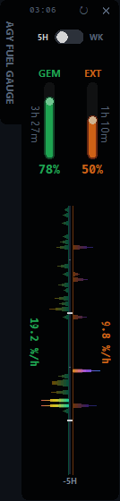
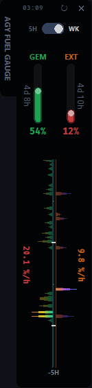

# AGY Fuel Gauge 🚀

Most telemetry tools introduce unnecessary cognitive load with complex dashboards and extensive configuration files. AGY Fuel Gauge provides a minimalist alternative: a zero-config, frameless widget that monitors your remaining AI quotas without interrupting your workflow. Instead of requiring API credentials, it bypasses authentication by directly intercepting the gRPC-Web traffic from your local `language_server.exe` daemon. It runs silently in the background and requires zero manual setup.

<p align="center">
  
  &nbsp;&nbsp;&nbsp;&nbsp;
  
</p>

## Tech Specs
1. **Zero Auth API Hook**: Extracts port and `x-codeium-csrf-token` from `language_server.exe` logs. Hooks internal gRPC-Web directly.
2. **GDI Frameless UI**: Windows `SetWindowRgn` for an L-shaped window. Pure black canvas.
3. **Continuous Waveform (Core-to-Edge)**: Replaces discrete blocks with a gapless, continuous polygon generated via PIL masking. Provides a seamless visual scale up to 10.0% while eliminating high-DPI subpixel artifacts. Includes view-only hover tooltips for exact telemetry.
4. **Dual-Layer Anomaly Highlighting**: 3-keyframe gradient (GEM: Green→Yellow→Red; EXT: Orange→Purple→Blue). Normal usage (<10%) forms a dimmed background mountain range, while spikes (≥10%) are cut into a secondary mask via `ImageChops` to reveal a piercing neon anomaly glow.
5. **Canvas Toggle**: Custom smooth sliding switch for 5H / WK views.
6. **Async Telemetry**: Background polling. Visualized by a random-jittered scanline animation.

## Compatibility
- **Antigravity 2.0 Desktop**: Supported (via Sidecar).
- **Antigravity IDE**: Supported.
- **Antigravity CLI**: Not supported.

## Installation

1. **Clone Repo**
   ```bash
   git clone https://github.com/YuJunWang/AGY_Fuel_Gauge.git
   cd AGY_Fuel_Gauge
   ```

2. **Install Deps**
   ```bash
   pip install pystray Pillow
   ```

3. **Configure Sidecar**
   Create `C:\Users\<Username>\.gemini\config\sidecars\agy-fuel-gauge\sidecar.json`:
   ```json
   {
     "description": "AGY Fuel Gauge",
     "command": "pythonw",
     "args": [
       "E:\\Path\\To\\AGY_Fuel_Gauge\\widget.py"
     ],
     "restart_policy": "always"
   }
   ```

Restart Antigravity IDE. Gauge icon loads in system tray. Right-click to wake, hit `✕` to hide.

---

# AGY Fuel Gauge（中文說明）🚀

多數的監控工具往往伴隨著複雜的儀表板與繁瑣的設定檔，反而增加了開發者的認知負擔。AGY Fuel Gauge 提供了一個極簡的替代方案：這是一款免設定、無邊框的桌面小工具，能在不打斷心流的情況下即時監看 AI 剩餘額度。它不需要使用者輸入任何 API 憑證，而是透過直接攔截本地端 `language_server.exe` 的 gRPC-Web 流量來解析數據。你只需啟動程式，它便會在系統背景安靜執行，完全無需手動設定。

## 核心技術
1. **API 自動掛載**：動態抓取 `language_server.exe` 的 port。從日誌挖出 token，直連內部 gRPC-Web。
2. **GDI 無邊框渲染**：呼叫 Windows `SetWindowRgn`。做出不規則 L 型純黑視窗。
3. **無縫連續波形 (Continuous Waveform)**：捨棄離散方塊，改以 PIL 遮罩技術繪製零縫隙的平滑連續多邊形，提供高達 10.0% 的精巧視覺刻度。內建純檢視用懸浮提示 (Hover Tooltip) 以供精準讀值。
4. **雙層遮罩異常凸顯 (Dual-Layer Anomaly Highlighting)**：三節點漸層（GEM：綠黃紅；EXT：橘紫藍）。常態用量 (<10%) 構成幽暗的背景波形山脈，而用量突波 (≥10%) 則透過 `ImageChops` 疊加交集遮罩，精準切出刺眼的霓虹高光警示。
5. **平滑滑動開關**：自定義 Canvas 繪製 5H / WK 切換鈕。視覺與資訊完美分離。
6. **非同步資料同步**：背景抓數據。成功抓取時會觸發帶有隨機雜訊（Jitter）的折線微動畫。

## 支援環境
- **Antigravity 2.0（桌面版）**：支援。走 Sidecar 機制。
- **Antigravity IDE**：支援。
- **Antigravity CLI**：不支援。沒有背景精靈可以聽。

## 安裝步驟

1. **下載專案**
   ```bash
   git clone https://github.com/YuJunWang/AGY_Fuel_Gauge.git
   cd AGY_Fuel_Gauge
   ```

2. **安裝套件**
   ```bash
   pip install pystray Pillow
   ```

3. **掛載背景執行（推薦）**
   在 `C:\Users\<帳號>\.gemini\config\sidecars\` 建立 `agy-fuel-gauge` 資料夾。新增 `sidecar.json`：
   ```json
   {
     "description": "AGY Fuel Gauge",
     "command": "pythonw",
     "args": [
       "E:\\你的路徑\\AGY_Fuel_Gauge\\widget.py"
     ],
     "restart_policy": "always"
   }
   ```

重啟 Antigravity IDE。右下角系統匣會出現圖示。點 `✕` 縮小到背景，對圖示點右鍵可重新喚醒。
